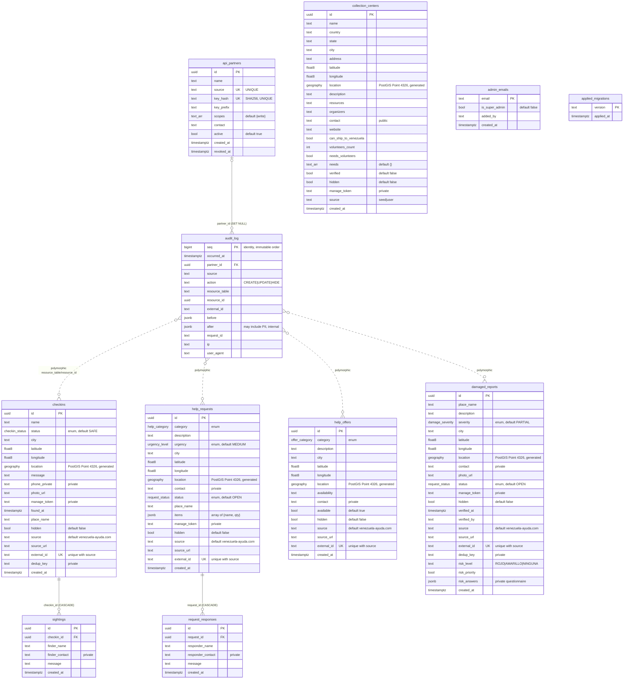

# Database Schema — Venezuela Ayuda

Supabase / PostgreSQL database. Schema is defined by SQL migrations in
[`supabase/migrations/`](../supabase/migrations/) (`0001`–`0020`).
Extensions: **PostGIS** (spatial `location` columns + GiST indexes) and **pgcrypto** (UUIDs).

This document reflects the schema in its current form. To regenerate the image:

```bash
npx -y @mermaid-js/mermaid-cli -i docs/database-schema.md -o docs/database-schema.png
```

## ER Diagram



## Notes

### Table groups
- **Core report tables** — `checkins`, `help_requests`, `help_offers`, `damaged_reports`. All location-aware, all support external ingestion via `(source, external_id)`.
- **Relay tables** — `sightings` (replies to a check-in), `request_responses` (volunteer replies to a help request). Both CASCADE-deleted with their parent.
- **Admin / operational** — `admin_emails` (admin allowlist), `api_partners` (ingestion partners + hashed API keys), `collection_centers` (donation/relief points), `audit_log` (append-only change trail).
- **Metadata** — `applied_migrations` (CI migration tracking).

### Relationships
| From | Column | To | On Delete |
|------|--------|----|-----------|
| `sightings` | `checkin_id` | `checkins.id` | CASCADE |
| `request_responses` | `request_id` | `help_requests.id` | CASCADE |
| `audit_log` | `partner_id` | `api_partners.id` | SET NULL |

`audit_log` also carries a **polymorphic** pointer (`resource_table` + `resource_id`) into any of the 4 core tables — shown as dashed edges in the diagram. There is no DB-level FK for this link.

### PostGIS `location`
On `checkins`, `help_requests`, `help_offers`, `damaged_reports`, `collection_centers` the `location` column is a `geography(Point, 4326)` **generated/stored** from `latitude`/`longitude`, indexed with GiST for radius queries.

### Audited writes & RPCs
All writes — external API *and* internal server actions — flow through service-role-only RPCs that mutate the table and append the matching `audit_log` row in one transaction:
- `ingest_reports()` — batch create. The 4 core tables upsert idempotently on their `UNIQUE(source, external_id)` index; `collection_centers` (no `external_id`) inserts a new row per record (added in 0018).
- `patch_report()` — partial update by `id`.
- `delete_report()` — real delete with a `before` snapshot, audited as `action=DELETE` (added in 0018).

### Permission hardening (0019)
`TRUNCATE` is revoked from `anon`/`authenticated` on all `public` tables (RLS does not cover TRUNCATE), and `audit_log` is fully closed to public roles — it's read only via the service key.

### Admin tiers (0020)
`admin_emails.is_super_admin` adds a privilege tier: regular admins moderate reports/centers; super-admins additionally manage admins, issue/revoke API keys, and run batch ingest. Enforced in server actions (`requireSuperAdmin`).

### Privacy-safe public views
Writes to all tables are locked to the service key (RLS, no public INSERT policies). Anonymous reads go through views that strip private columns:

| View | Source table | Excludes | Extra filter |
|------|--------------|----------|--------------|
| `public_checkins` | `checkins` | `phone_private`, `manage_token`, `dedup_key` | `hidden = false` |
| `public_help_requests` | `help_requests` | `contact`, `manage_token` | `hidden = false` |
| `public_help_offers` | `help_offers` | `contact` | `hidden = false` |
| `public_damaged_reports` | `damaged_reports` | `contact`, `manage_token`, `risk_answers`, `dedup_key` | `hidden = false` |
| `public_collection_centers` | `collection_centers` | `manage_token` | `verified = true AND hidden = false` |

### Enum types
| Enum | Values |
|------|--------|
| `checkin_status` | `SAFE`, `NEEDS_HELP`, `LOOKING_FOR_SOMEONE` |
| `help_category` | `medical`, `food`, `water`, `shelter`, `transportation`, `electricity`, `rescue`, `tools` |
| `offer_category` | `transportation`, `food`, `shelter`, `medical`, `supplies`, `translation` |
| `urgency_level` | `LOW`, `MEDIUM`, `HIGH`, `CRITICAL` |
| `request_status` | `OPEN`, `IN_PROGRESS`, `RESOLVED` |
| `damage_severity` | `CRACKS`, `PARTIAL`, `COLLAPSE_RISK`, `COLLAPSED` |
